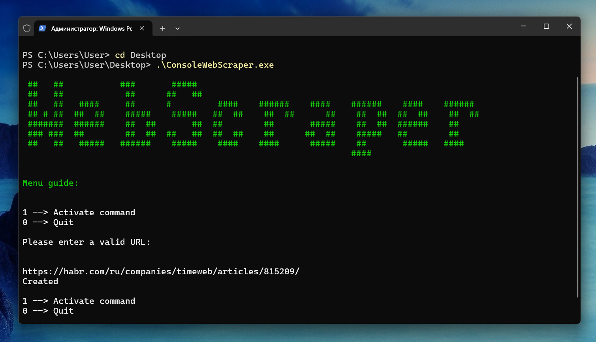

# ConsoleWebScraper


ConsoleWebScraper is a simple console application that allows you to scrape web pages and save the results. It's built in C# and uses .NET Core.

## Features

- **URL Input**: The program prompts the user to enter a URL. It then sends a GET request to that URL and retrieves the HTML content.

- **HTML Parsing**: The program uses regular expressions to parse the HTML content. It can extract inner URLs and images from the HTML.

- **File Saving**: The program can save the scraped URLs, images, and the HTML content (with HTML tags removed) to separate files.

## Usage

1. Open a command prompt as administrator.
2. Navigate to the directory containing the utility.
3. Run the utility as a command-line argument. For example:

    ```
    .\ConsoleWebScraper.exe
    ```
4. When you start the application, you'll see a title and a menu guide. The menu guide will tell you what commands you can use.

## Note

This is a basic web scraper and may not work with all websites, especially those that heavily rely on JavaScript for rendering content or have measures in place to prevent scraping.

## Contributing

Pull requests are welcome. For major changes, please open an issue first to discuss what you would like to change.

## Author

Bohdan Harabadzhyu
